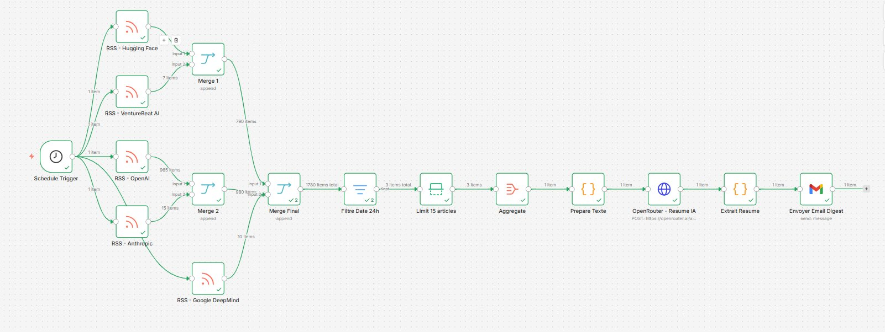
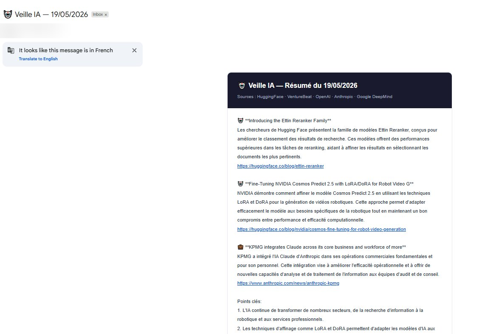

# Veille IA Automatique — N8N Workflow


Workflow N8N qui surveille automatiquement les sources d'actualité en intelligence artificielle et envoie chaque matin un résumé structuré en français par email. Le résumé est généré par un modèle IA gratuit via OpenRouter.

---

## Demo

### Le workflow dans N8N



### Email recu chaque matin



---

## Fonctionnalités

- Surveillance de 5 sources RSS officielles dans le domaine de l'IA
- Filtrage automatique des articles des dernières 24 heures
- Résumé en français généré par IA, groupé par thème
- Liens cliquables vers chaque article original
- Un seul email par jour, sans spam
- Entièrement gratuit — OpenRouter (modèle free) + Gmail
- Aucune ligne de code à écrire

---

## Sources surveillées

| Source | Contenu |
|--------|---------|
| HuggingFace Blog | Nouveaux modèles et releases |
| VentureBeat AI | Actualités business et produits |
| OpenAI News | Annonces officielles OpenAI |
| Anthropic News | News Claude et recherche |
| Google DeepMind | Recherche avancée en IA |

---

## Prerequis

| Outil | Usage | Cout |
|-------|-------|------|
| [N8N](https://n8n.io) | Plateforme d'automatisation | Gratuit |
| [OpenRouter](https://openrouter.ai) | API IA via modele GLM 4.5 Air | Gratuit |
| Gmail | Envoi de l'email digest | Gratuit |

---

## Installation

### 1. Importer le workflow

1. Ouvre N8N
2. Clique sur **New Workflow** puis **Import from file**
3. Selectionne le fichier `workflow_veille_ia_v8.json`
4. Le workflow apparait avec tous les noeuds connectes

### 2. Configurer OpenRouter

1. Cree un compte sur [openrouter.ai](https://openrouter.ai)
2. Va dans **Keys** puis **Create Key**
3. Copie la cle generee (format `sk-or-v1-...`)
4. Dans le noeud **OpenRouter - Resume IA**, trouve le header `Authorization`
5. Remplace `VOTRE_CLE_API_OPENROUTER` par `Bearer sk-or-v1-TACLÉ`

> Note : le mot `Bearer` suivi d'un espace est obligatoire avant la cle.

> Important : ne partage jamais ta cle API publiquement.

### 3. Configurer Gmail

1. Dans N8N, va dans **Settings** puis **Credentials** puis **Add Credential**
2. Selectionne **Gmail OAuth2 API** et connecte ton compte Google
3. Dans le noeud **Envoyer Email Digest**, remplace `VOTRE_EMAIL@exemple.com` par ton adresse

### 4. Activer le workflow

Clique sur le toggle **Active** en haut a droite. Le workflow se lancera automatiquement chaque matin a 6h00.

---

## Architecture

```
Schedule Trigger (6h00)
        |
        |--- RSS - Hugging Face
        |--- RSS - VentureBeat AI
        |--- RSS - OpenAI
        |--- RSS - Anthropic
        |--- RSS - Google DeepMind
        |
      Merge 1 + Merge 2 + Merge Final
        |
      Filtre Date 24h
        |
      Limit 15 articles
        |
      Aggregate
        |
      Prepare Texte (Code JS)
        |
      OpenRouter - Resume IA (HTTP Request)
        |
      Extrait Resume (Code JS)
        |
      Envoyer Email Digest (Gmail)
```

### Description des noeuds

| Noeud | Type | Role |
|-------|------|------|
| Schedule Trigger | Trigger | Declenche le workflow a 6h00 chaque jour |
| RSS - Hugging Face | RSS Feed | Recupere les articles HuggingFace |
| RSS - VentureBeat AI | RSS Feed | Recupere les articles VentureBeat |
| RSS - OpenAI | RSS Feed | Recupere les annonces OpenAI |
| RSS - Anthropic | RSS Feed | Recupere les news Anthropic |
| RSS - Google DeepMind | RSS Feed | Recupere les articles Google IA |
| Merge 1 / Merge 2 / Merge Final | Merge | Fusionne toutes les sources en une liste |
| Filtre Date 24h | Filter | Conserve uniquement les articles du jour |
| Limit 15 articles | Limit | Limite a 15 articles maximum |
| Aggregate | Aggregate | Regroupe tous les articles en un seul item |
| Prepare Texte | Code JS | Nettoie et formate les titres pour l'IA |
| OpenRouter - Resume IA | HTTP Request | Genere le resume avec GLM 4.5 Air |
| Extrait Resume | Code JS | Extrait et formate la reponse de l'IA |
| Envoyer Email Digest | Gmail | Envoie l'email HTML final |

---

## Personnalisation

### Changer la frequence d'envoi

Dans le noeud **Schedule Trigger**, modifie l'expression cron :

```
0 6 * * *    — tous les jours a 6h00 (defaut)
0 8 * * 1-5  — du lundi au vendredi a 8h00
```

### Changer la periode du filtre

Dans le noeud **Filtre Date 24h** :

```javascript
// 24 heures (defaut)
$now.minus(1, 'days').toMillis()

// 3 jours (si peu d'articles disponibles)
$now.minus(3, 'days').toMillis()
```

### Ajouter des sources RSS

Duplique un noeud RSS existant et remplace l'URL :

```
MIT Technology Review AI  : https://www.technologyreview.com/topic/artificial-intelligence/feed
TechCrunch AI             : https://techcrunch.com/category/artificial-intelligence/feed
Arxiv Machine Learning    : https://rss.arxiv.org/rss/cs.LG
```

### Changer le modele IA

Dans le noeud **OpenRouter - Resume IA**, remplace la valeur du champ `model` :

```
z-ai/glm-4.5-air:free              (defaut)
google/gemma-3-12b-it:free
mistralai/mistral-7b-instruct:free
```

Liste complete des modeles gratuits : [openrouter.ai/models](https://openrouter.ai/models?q=free)

---

## Fichiers du repo

```
n8n-veille-ia/
├── README.md
├── workflow_veille_ia_v8.json
└── GUIDE_INSTALLATION.md
```

---

## Roadmap

- [x] Workflow de base — 5 sources RSS, resume IA, email digest quotidien
- [ ] v2 — Envoi du resume en message vocal sur Telegram
- [ ] v3 — Score de popularite par article
- [ ] v4 — Dashboard de suivi des tendances IA

---

## Licence

MIT — libre d'utilisation, de modification et de partage.
